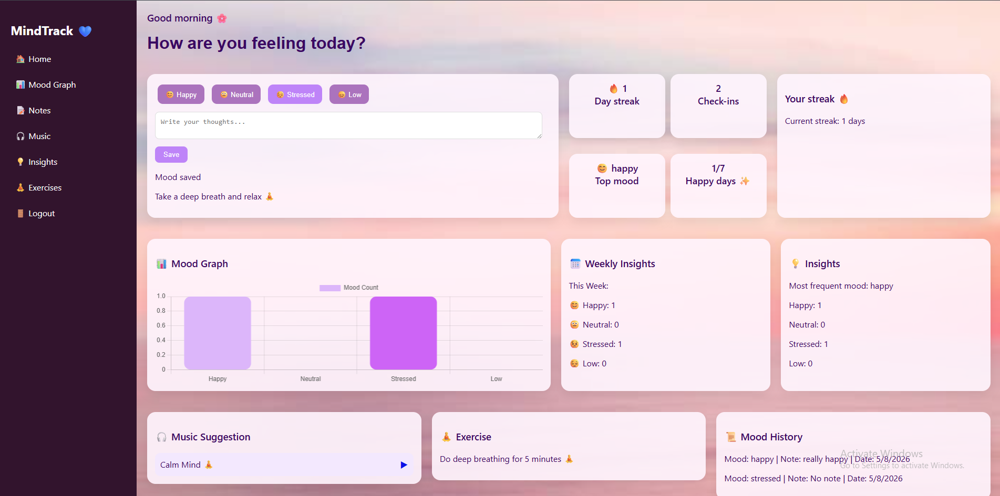
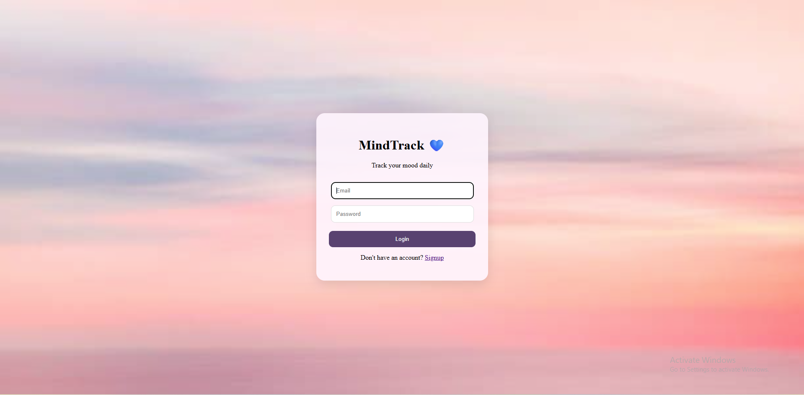

# MindTrack 🌸

A full-stack mood tracking web application that helps users track emotions, maintain streaks, view insights, and improve mental wellness through music and exercise suggestions.

🌐 **Live Demo:** [https://curious-tarsier-c5dabc.netlify.app](https://curious-tarsier-c5dabc.netlify.app)

## ✨ Features

* 🔐 User Authentication (Signup/Login)
* 😊 Daily Mood Tracking
* 📝 Personal Notes
* 📊 Mood Analytics & Charts
* 🔥 Streak Tracking
* 🎵 Mood-Based Music Suggestions
* 🧘 Mood-Based Exercise Suggestions
* 📅 Weekly Mood Insights
* ☁ Cloud Database with MongoDB Atlas
* 🌍 Fully Deployed Full-Stack Application

---

# 🛠 Tech Stack

## Frontend

* HTML
* CSS
* JavaScript
* Chart.js

## Backend

* Node.js
* Express.js

## Database

* MongoDB Atlas
* Mongoose

## Authentication

* JWT (JSON Web Token)
* bcrypt

## Deployment

* Frontend: [Netlify](https://www.netlify.com?utm_source=chatgpt.com)
* Backend: [Render](https://render.com?utm_source=chatgpt.com)
* Database: [MongoDB Atlas](https://www.mongodb.com/atlas?utm_source=chatgpt.com)

---

# 🚀 Features Overview

### 🔐 Authentication

Users can securely create accounts and log in using JWT-based authentication.

### 😊 Mood Logging

Track moods like:

* Happy
* Neutral
* Stressed
* Low

along with optional notes.

### 📊 Analytics Dashboard

* Mood frequency analysis
* Most frequent mood
* Happy day counter
* Weekly insights
* Mood visualization chart

### 🔥 Streak System

Tracks consecutive days of mood check-ins.

### 🎵 Music Recommendations

Provides mood-based music suggestions using embedded YouTube links.

### 🧘 Wellness Suggestions

Suggests exercises and wellness activities according to the selected mood.

---

# 📂 Project Structure

```text id="mfh3sl"
MindTrack/
│
├── Frontend/
│   ├── index.html
│   ├── login.html
│   ├── signup.html
│   ├── style.css
│   └── script.js
│
├── Backend/
│   ├── server.js
│   ├── package.json
│   └── .env
│
└── README.md
```

---

# ⚙ Environment Variables

Create a `.env` file inside the Backend folder:

```env id="d0h2kr"
MONGO_URI=your_mongodb_connection_string

JWT_SECRET=your_secret_key
```

---

# ▶ Run Locally

## Backend

```bash id="x5t1pk"
cd Backend
npm install
node server.js
```

## Frontend

Open `index.html` in browser.

---

# 🌍 Deployment

* Frontend deployed on [Netlify](https://www.netlify.com?utm_source=chatgpt.com)
* Backend deployed on [Render](https://render.com?utm_source=chatgpt.com)
* Database hosted on [MongoDB Atlas](https://www.mongodb.com/atlas?utm_source=chatgpt.com)

---

# 📸 Screenshots


| Dashboard | Login |
|---|---|---|
|  |  | 

---

# 💡 Future Improvements

* Dark/Light Mode
* AI-based mood analysis
* Journal export feature
* Notifications & reminders
* Mobile app version

---

# 👩‍💻 Author

Made with 💜 by Disha.
